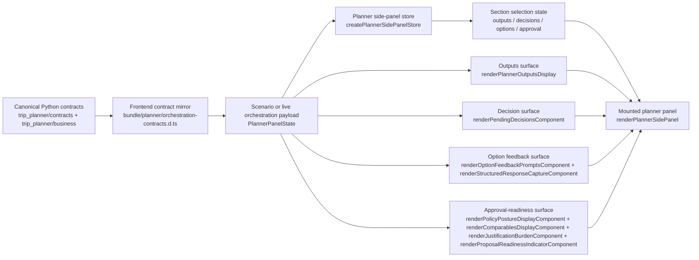

# Planner UI Integration

This document shows how orchestration-facing planner payloads land in the interactive side-panel UI and how business policy states map to the approval-readiness surfaces.

## Data Flow



## Consumption Example

The planner UI consumes a single `PlannerPanelState` payload and derives the visible sections from its orchestration outputs.

```js
import {
  buildPlannerUiConsumptionExample,
  mapPolicyStateToUiComponents,
} from "./scripts/planner_ui_consumption_example.js";

const uiShape = buildPlannerUiConsumptionExample(panelState);
const approvalShape = mapPolicyStateToUiComponents(panelState.policy_evaluation);

console.log(uiShape.sections);
console.log(approvalShape.mapped_components);
```

The helper module above is intentionally small and mirrors the production panel contract shape used in:

- `bundle/planner/orchestration-contracts.d.ts`
- `bundle/planner/side-panel.js`
- `bundle/planner/mock-state.js`

### Example: Orchestration Outputs To UI Sections

```js
const uiShape = buildPlannerUiConsumptionExample(panelState);

// Example result:
// {
//   summary: {
//     trip_id: "trip-client-audit-sea",
//     mode: "business",
//     active_signals: ["2 outputs", "1 pending decisions", "2 options"]
//   },
//   sections: {
//     outputs: 2,
//     decisions: 1,
//     options: 2,
//     approval: true
//   },
//   approval: {
//     status: "exception_required",
//     mapped_components: [
//       "renderPolicyPostureDisplayComponent",
//       "renderComparablesDisplayComponent",
//       "renderJustificationBurdenComponent",
//       "renderProposalReadinessIndicatorComponent"
//     ]
//   }
// }
```

### Example: Policy Evaluation To Approval Widgets

```js
const approvalShape = mapPolicyStateToUiComponents(panelState.policy_evaluation);

// Example result:
// {
//   status: "exception_required",
//   posture_tone: "caution",
//   readiness_label: "exception packet ready",
//   blocking_failure_count: 0,
//   approval_requirement_count: 2,
//   mapped_components: [
//     "renderPolicyPostureDisplayComponent",
//     "renderComparablesDisplayComponent",
//     "renderJustificationBurdenComponent",
//     "renderProposalReadinessIndicatorComponent"
//   ]
// }
```

## Policy State Mapping

| Policy evaluation state | UI display components | Expected user-facing treatment |
| --- | --- | --- |
| `compliant` | `renderPolicyPostureDisplayComponent`, `renderComparablesDisplayComponent`, `renderJustificationBurdenComponent`, `renderProposalReadinessIndicatorComponent` | Show positive posture, approval checklist, comparables, and submission-ready packet details. |
| `exception_required` | `renderPolicyPostureDisplayComponent`, `renderComparablesDisplayComponent`, `renderJustificationBurdenComponent`, `renderProposalReadinessIndicatorComponent` | Show caution posture, required approvers, exception packet details, and readiness progress for the exception path. |
| `non_compliant` | `renderPolicyPostureDisplayComponent`, `renderComparablesDisplayComponent`, `renderJustificationBurdenComponent`, `renderProposalReadinessIndicatorComponent` | Show critical posture, blocking failures, fallback comparables, and a blocked readiness indicator until remediation exists. |
| `inactive` (`policy_evaluation === null`) | Empty-state copy from approval components | Business approval-readiness is not active for this planner state, so the panel stays in interactive planning mode only. |

## Notes

- `PlannerPanelState` is the contract boundary between orchestration and the side-panel UI.
- `proposal` and `policy_evaluation` together activate the business approval-readiness section.
- Structured response actions remain part of the option surface; policy status only changes the approval section.
